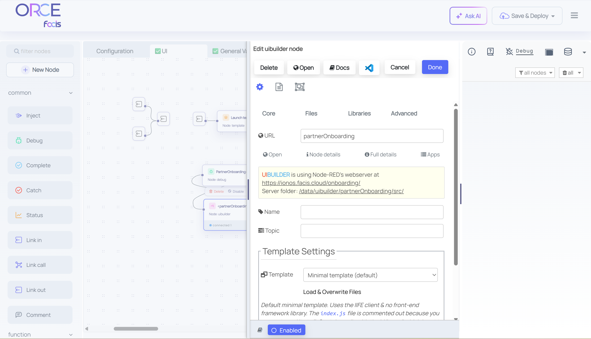
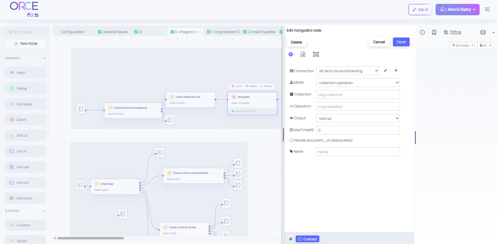
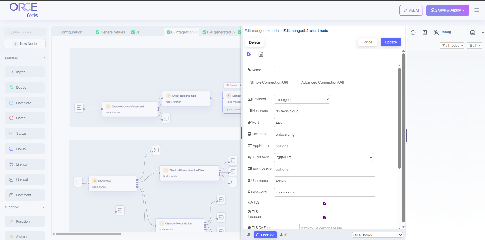
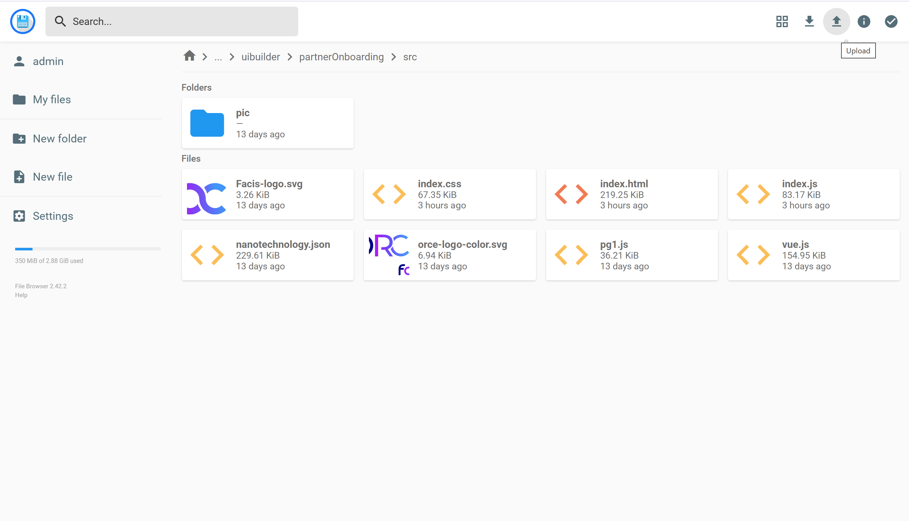

# Reference FAP – Partner Onboarding  
[](https://github.com/eclipse-xfsc/orchestration-engine)
[](https://www.apache.org/licenses/LICENSE-2.0)
[](#)
[](#)

---

## **1. Introduction**

The **Reference FAP (Federation Architecture Pattern)** for **Partner Onboarding** provides a complete, production-ready implementation of the onboarding lifecycle inside **Federated Ecosystems** — distributed infrastructures where multiple organizations interconnect, exchange, and validate data and services under a unified trust and compliance framework.

This project is entirely implemented as a **flow-based application** executed on **ORCE (Orchestration Engine)**.  
ORCE acts solely as the **execution environment**, while the flow itself defines all business logic, configurations, integrations, and validation steps declaratively.

The onboarding process includes six major phases:

1. Verify certificates  
2. Create DID and chain files  
3. Publish and verify identity resources  
4. Generate credential IDs and registry checks  
5. Issue Verifiable Credentials (VCs)  
6. Create a Verifiable Presentation (VP)

All communication between the flow and external verification or trust systems is handled directly inside the orchestration logic.

After the Verifiable Presentation (VP) is generated, the flow automatically triggers outbound requests to federated trust anchors and compliance verification services.  
These endpoints are defined inside the flow as HTTP Request nodes responsible for:

- Submitting the Verifiable Presentation (VP) to the Compliance API for trust validation and conformity checks  
- Interacting with Trust Anchor services (such as Notary, Registry, or Signing endpoints) to validate digital proofs, timestamps, and signatures  
- Exchanging status and validation responses back into the runtime context (msg.complianceResult, msg.validationStatus, etc.) for subsequent processing or UI rendering

This mechanism ensures that every onboarding session passes through a complete verification cycle, including cryptographic validation of issued credentials and external compliance confirmation from the federated infrastructure.  
The communication logic is embedded in the final flow sections (Step 5 – Issue Verifiable Credentials and Step 6 – Create Verifiable Presentation), using ORCE’s native HTTP nodes to orchestrate interactions between the internal onboarding process and external Trust Anchor services.

---

# **Deployment Guide for Onboarding Platform**

A quick and reliable setup guide to deploy and run the Reference FAP flow on ORCE.

---

## Step 0 — Easy Deployment (Single Command)

Before importing or configuring the Reference FAP, you first need to start an ORCE instance.  
The following command runs ORCE using the official `ecofacis/xfsc-orce:2.0.12` image:

```bash
docker run -d --name orce -p 1880:1880 -p 8080:8080 ecofacis/xfsc-orce:2.0.12
```
```
Port 1880 → ORCE Editor / Deployment Interface
Port 8080 → ORCE File Browser / uibuilder Source Access
```
Access the ORCE Editor in your browser at `http://localhost:1880` to import and deploy the Reference FAP flow.
Use port 8080 to upload your UI source files and static assets after deployment.

Default ORCE Username and Password:
```
username: admin
password: xfsc-orce
```

Once the ORCE container is running, you can proceed with Step 1 to import the flows.full.json (Reference FAP flow) and apply your configurations.

---

## **Step 1 — Import the Flow and Apply Required Configurations**

This step covers importing [`flows.full.json`](./flows/flows.full.json) into your **ORCE engine**, setting the **uibuilder URL**, and configuring the **MongoDB** connection used by the [**0-Integration Flow**](https://github.com/eclipse-xfsc/facis-fap1-implementation/blob/main/flows/tabs/0-Integration%20Flow.json) (and other MongoDB nodes).

---

### **1.1 Import the flows.full.json Flow**

1. Open **ORCE → Menu ≡ → Import (Ctrl + I)**  
2. Paste or upload `flows.full.json`  
3. Click **Import** (do *not* deploy yet)

---

### **1.2 Configure the uibuilder Node**

Locate the ✅ **UI flow** and open the **uibuilder node**.

- In the URL field, set any short and unique path name you prefer (for example: /partneronboarding).
- Make sure it does not conflict with existing HTTP routes.



---

### **1.3 Configure MongoDB Connection**

In the ✅ [**0-Integration Flow**](https://github.com/eclipse-xfsc/facis-fap1-implementation/blob/main/flows/tabs/0-Integration%20Flow.json), open the **MongoDB node** → click the **pencil icon** next to the connection field and fill in:

```
Username: yourUsername
Password: yourPassword
Host: mongodb+srv://your-cluster.mongodb.net
Database: yourDatabaseName
```

Click **Update**, then **Done**.  

  


> **Tip:** once one MongoDB connection configuration is changed, all nodes sharing that configuration will inherit it automatically.

---

### **1.4 General Values Flow Configuration**

Open the flow named **General Values** to view static data:

- `apiAiKey` — API key for AI integration  
- `Checksum` — used for VC file synchronization  

Modify values as needed *before* deploying. Changes after deployment require redeployment.

---

### **1.5 Deploy the Flow**

Click **Deploy** in the top-right corner.  
If configured correctly, deployment completes successfully. Fix any errors before retrying.

---

## **Step 2 — Upload uibuilder Source Files**

Upload the front-end UI source to enable the web interface.

---

### **2.1 Locate the uibuilder Directory**

Browse to:

```
https://{your-domain}/fscloud/files/data/uibuilder/{your-uibuilder-url}/src/
```

Open the folder matching your uibuilder URL (e.g. `/partneronboarding`) → `src/`.


---

### 2.2 Upload the Source Files

All required UI files are already included in this repository under the ui/src/ folder.  
You can simply open that folder on your local machine and upload its contents here — there’s no need to build or compress anything.

1. In the engine’s File Browser, click the Upload (↑) button.  
2. Navigate to ui/src/ inside this repository.  
3. Select all files (index.html, index.js, index.css, images, etc.) and upload them directly.  
4. Once uploaded, they will appear in the /src directory of your uibuilder path.



You can also open the file browser inside ORCE and drag-and-drop the files into this folder — whichever is easier for you.

---

### **2.3 Verify Upload and UI Functionality**

Return to the ORCE editor → double-click the **uibuilder node** → click **Open**.  
If the UI loads in a new tab, the setup is complete.  

✅ **Deployment Complete!**

---

# **Technical Reference and Developer Documentation**

## **3 – System Overview**

```
+---------------------------------------------------------+
|               ORCE (Orchestration Engine)               |
|     Execution environment for flow-based automation     |
+---------------------+-----------------------------------+
                      |
                      v
+----------------------------------------------------------+
|        Reference FAP Flow – Partner Onboarding           |
|----------------------------------------------------------|
| Step 1: Verify Certificates                              |
| Step 2: Create Decentralized Identifier (DID)            |
| Step 3: Publish and Verify Identity Resources            |
| Step 4: Generate Credential IDs and Check Registries     |
| Step 5: Issue Verifiable Credentials (VCs)               |
| Step 6: Create Verifiable Presentation (VP)              |
+----------------------------------------------------------+
                      |
                      v
        [ Federation Services: Wizard, Compliance, Registry ]
```

---

## 4 – Flow Architecture and Logic

| Step | Description | Input | Output |
|------|--------------|--------|--------|
| 1 | Verify RSA/X.509 certificates | Bundle.ca-bundle, Certificate.crt, pvtKey.key | msg.data.recordDetails.files.result |
| 2 | Create DID and chain files | Organization data | msg.data.recordDetials.downloadFiles.did.fileContent, msg.data.recordDetials.downloadFiles.chain.fileContent |
| 3 | Publish and verify URLs | DID URLs | msg.data.recordDetails.urls.state |
| 4 | Generate credential IDs and check registries | DID | msg.data.recordDetails.ids |
| 5 | Issue Verifiable Credentials | VC IDs | msg.data.recordDetails.vcs |
| 6 | Create Verifiable Presentation | Signed VCs | msg.data.recordDetails.vp |

---

## **5 – Data Model and Message Contract**

### **Input Example**
```json
{
  "@context": [
    "https://www.w3.org/ns/credentials/v2",
    "https://w3id.org/gaia-x/development#"
  ],
  "type": [
    "VerifiableCredential",
    "gx:VatID"
  ],
  "id": "https://example.com/.well-known/lrn.json",
  "name": "VAT ID",
  "description": "Value Added Tax Identifier",
  "issuer": "did:web:compliance.example.org:notary:v2",
  "validFrom": "2025-10-12T11:01:42.092+00:00",
  "validUntil": "2025-10-15T23:59:59.000+00:00",
  "credentialSubject": {
    "id": "https://example.com/.well-known/lrn.json#subject",
    "type": "gx:VatID",
    "gx:vatID": "DE123456789",
    "gx:countryCode": "DE"
  },
  "evidence": {
    "gx:evidenceOf": "gx:VatID",
    "gx:evidenceURL": "http://ec.europa.eu/taxation_customs/vies/services/checkVatService",
    "gx:executionDate": "2025-10-12T11:01:42.092+00:00"
  }
}

```

### **Output Example**
```json
{
  "@context": [
    "https://www.w3.org/ns/credentials/v2",
    "https://w3id.org/gaia-x/development#"
  ],
  "type": [
    "VerifiableCredential",
    "gx:LabelCredential"
  ],
  "id": "https://example.com/.well-known/credential-offers/demo-label",
  "issuer": "did:web:compliance.example.org:notary:v2",
  "validFrom": "2025-10-12T11:01:53.348Z",
  "validUntil": "2025-10-15T23:59:59.000Z",
  "credentialSubject": {
    "id": "https://example.com/.well-known/credential-offers/demo-label#cs",
    "gx:labelLevel": "SC",
    "gx:engineVersion": "2.9.0",
    "gx:rulesVersion": "CD25.03",
    "gx:compliantCredentials": [
      {
        "id": "https://example.com/.well-known/legal-person.json",
        "type": "gx:LegalPerson,gx:LegalPerson",
        "gx:digestSRI": "sha256-xxxx"
      },
      {
        "type": "gx:Issuer",
        "gx:digestSRI": "sha256-xxxx"
      },
      {
        "id": "https://example.com/.well-known/lrn.json",
        "type": "gx:VatID,gx:VatID",
        "gx:digestSRI": "sha256-xxxx"
      }
    ],
    "gx:validatedCriteria": [
      "https://docs.gaia-x.eu/policy-rules-committee/compliance-document/25.03/criteria_participant/#PA1.1"
    ]
  }
}

```

---

## **6 – Operations and Maintenance**

| Task | Command |
|------|----------|
| Logs | `docker logs -f orce` |
| Backup | Export flow (JSON) or snapshot `/data` |
| Restore | Menu → Import → Paste JSON |
| Update | Replace [`flows.full.json`](./flows/flows.full.json) → Redeploy |

---

## **7 – Summary**

| Category | Description |
|-----------|-------------|
| **Project** | Reference FAP – Partner Onboarding |
| **Platform** | ORCE (Orchestration Engine) |
| **Implementation** | Flow-based application (6-step orchestration) |
| **Domain** | Federated Ecosystem Onboarding |
| **Integrations** | Wizard, Compliance, Registry, Notary, OCM, CAT |
| **Deployment** | Manual flow import |
| **Security** | TLS |
| **Deliverables** | Flows, Documentations, ESBs |
| **License** | Apache 2.0 |

---

## **8 – References**

- [Eclipse XFSC – ORCE (Orchestration Engine)](https://github.com/eclipse-xfsc/orchestration-engine)  
- [Eclipse XFSC – FACIS Framework](https://github.com/eclipse-xfsc/facis)  
- [W3C Verifiable Credentials Data Model 2.0](https://www.w3.org/TR/vc-data-model-2.0/)  
- [W3C Decentralized Identifiers (DID) v1.0](https://www.w3.org/TR/did-core/)
